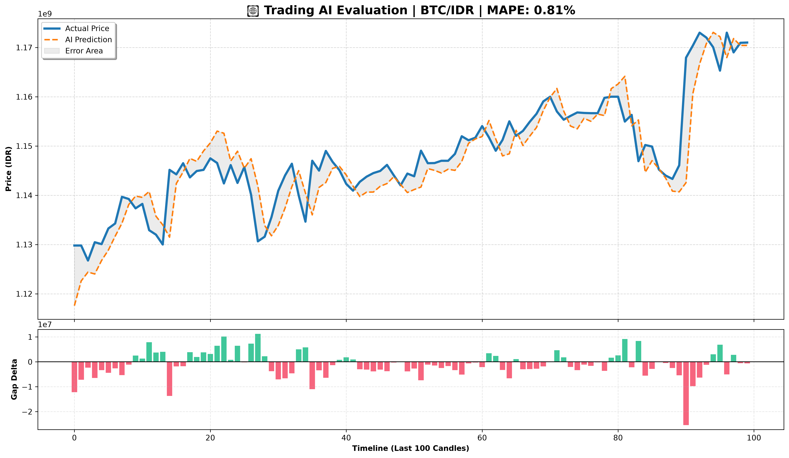

# Training Report: BTC/1h
**Generated on:** 2026-06-15 13:34:34
---
## Model Performance
- **MAPE Accuracy:** 0.81%
- **Directional Accuracy:** 46.85%
- **Mean Absolute Error (MAE):** Rp 10,840,257
## Model Architecture
- **Window Size (Lookback):** 60 periods
- **Total Features:** 12
- **Features Used:** `open, high, low, close, volume, vol_sma9, rsi, macd, atr, bb_h, bb_l, obv`
- **Architecture Base:** Sniper V2 (Conv1D + LSTM + Multi-Head Attention)
## Visual Evaluation

---
*Zenith Singularity - Autonomous Trading Ecosystem*
