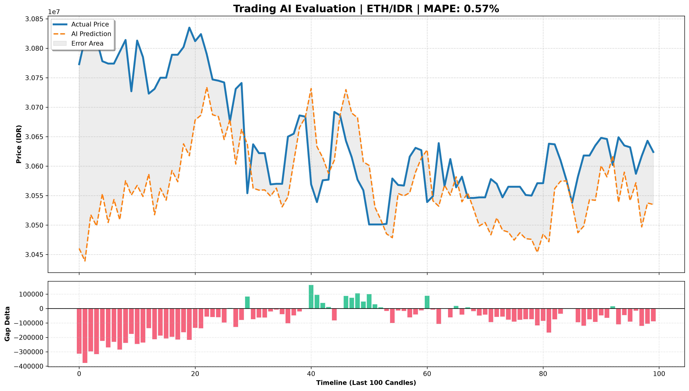

# Training Report: ETH/5
**Generated on:** 2026-06-15 14:32:48
---
## Model Performance
- **MAPE Accuracy:** 0.57%
- **Directional Accuracy:** 41.73%
- **Mean Absolute Error (MAE):** Rp 172,968
## Model Architecture
- **Window Size (Lookback):** 60 periods
- **Total Features:** 14
- **Features Used:** `open, high, low, close, volume, vol_sma9, rsi, macd, atr, bb_h, bb_l, obv, btc_close, btc_volume`
- **Architecture Base:** Sniper V2 (Conv1D + LSTM + Multi-Head Attention)
## Visual Evaluation

---
*Zenith Singularity - Autonomous Trading Ecosystem*
